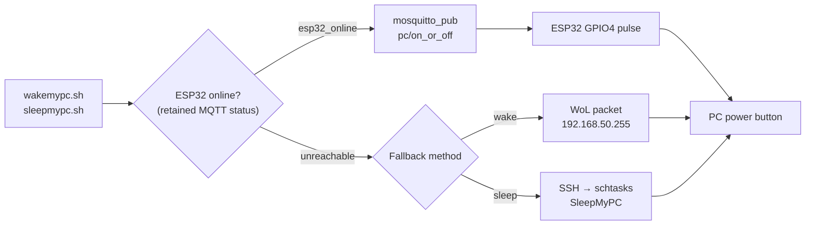

# ORION Architecture

This document describes the **actual working ORION architecture**.

---

## High-Level Overview

```mermaid
graph TB
    subgraph Internet
        TS[Tailscale Funnel]
    end

    subgraph "Raspberry Pi 5"
        FastAPI["FastAPI :8000<br/>Dashboard & Control Plane"]
        Nginx["Nginx :8082<br/>WebDAV + Jellyfin proxy"]
        Jellyfin["Jellyfin :8096<br/>Docker container"]
        Mosquitto["Mosquitto :1883<br/>MQTT Broker"]
        PiMon["Pi-Monitor<br/>Cron + SQLite"]
        Tailscale["Tailscale Serve<br/>HTTPS Routing"]
    end

    subgraph "ESP32 (Master Bedroom)"
        ESP32["ESP32-MDR<br/>MQTT → GPIO4 Power Button"]
    end

    subgraph "Desktop PC"
        PC["Windows PC<br/>192.168.0.102"]
    end

    subgraph "WD HDD (USB)"
        HDD1["/mnt/orion-media<br/>NTFS 1.4TB — read-only"]
        HDD2["/mnt/orion-data<br/>ext4 48GB — Docker + Jellyfin"]
    end

    TS <--> Tailscale
    Tailscale -->"|/"| Nginx
    Tailscale -->"|/app"| FastAPI
    Nginx -->"|/jellyfin"| Jellyfin
    FastAPI -->"|mosquitto_sub/pub"| Mosquitto
    Mosquitto <-->|"orion/pc/cmd<br/>orion/pc/status"| ESP32
    ESP32 -->"|GPIO4 pulse"| PC
    FastAPI -->"|Port 445 check"| PC
    PiMon -->"|metrics"| FastAPI
    Jellyfin --- HDD1
    HDD2 --- Jellyfin
```

---

## 1. Components

### 1.1 FastAPI Web App
- **Service**: `orion-webapp.service`
- **Port**: `8000`
- **Purpose**: Metrics visualization, system control, admin interface, service monitoring.
- **PC Detection**: Socket check on port 445 (SMB) with 2-second TTL cache — replaces the older `ping` method.

### 1.2 Nginx (WebDAV + Jellyfin Proxy)
- **Port**: `8082`
- **Config**: `/etc/nginx/sites-available/orion-webdav` (symlinked to `system_configs/nginx/orion-webdav`)
- **Location `/jellyfin`**: Proxies to Jellyfin on `127.0.0.1:8096` — no auth (Jellyfin handles its own login). WebSocket upgrade headers included for sync play / live TV.
- **Location `/`**: WebDAV — Basic Auth via `/etc/nginx/dav/users.htpasswd`, per-user directory isolation via `alias /mnt/orion-nas/users/$remote_user/`.
- **Features**: Multi-user isolation, setgid permissions for group persistence.

### 1.3 ESP32 Power Controller (Master Bedroom)
- **Hostname**: `esp-mdr`
- **Firmware**: PlatformIO (see `esp32/`)
- **Function**: Subscribes to MQTT topic `orion/pc/cmd`, shorts GPIO4 to simulate PC power button press.
- **Circuit**: 2N2222 NPN transistor wired in parallel with the cabinet power button (see diagram below).


- **Status**: Publishes retained `esp32_online` / `esp32_offline` (LWT) on `orion/pc/status`.
- **DHT11 Telemetry**: Publishes retained `{"temp":25.0,"hum":60.0}` on `orion/esp32/telemetry/dht` every 15s.
- **Commands**:

  | Command | Action |
  |---|---|
  | `pc/on_or_off` | Short press (500ms) — wake or sleep |
  | `pc/forceoff` | Long press (5s) — force power off |
  | `pc/pulse/<ms>` | Custom duration pulse |

### 1.4 Mosquitto (MQTT Broker)
- **Service**: `mosquitto.service`
- **Port**: `1883` (on `192.168.0.103`)
- **Purpose**: Message bus between Pi scripts and ESP32 devices.
- **Clients**: ESP32 (subscriber), shell scripts (publisher via `mosquitto_pub`).

### 1.5 Pi-Monitor (Data Collection)
- **Path**: `/home/orion/server/services/pi-monitor/`
- **DB**: SQLite (`pi-monitor.db`)
- **Collection**: Every minute via cron (`pi-monitor.sh`)
- **Metrics**: `cpu_temp`, `board_temp`, `fan_rpm`, `fan_pwm`, `cpu_freq`, `ram_used`, `load_1m`, `cpu_stress`, `room_temp`, `room_humidity`, `disk_usage_*`
- **Room Sensor**: DHT11 data read via ESP32 MQTT (`orion/esp32/telemetry/dht`), not GPIO.
- **Archival**: Weekly aggregation and pruning (`archive_weekly.sql`).

### 1.6 Jellyfin (Docker)
- **Container**: `jellyfin` (image: `jellyfin/jellyfin:latest`, `restart: unless-stopped`)
- **Port**: `8096`
- **Compose file**: `/opt/orion-docker/jellyfin/docker-compose.yml`
- **Docker data root**: `/mnt/orion-data/docker` (moved off SD card via `/etc/docker/daemon.json`)
- **Volumes**:
  - `/mnt/orion-data/jellyfin/config` → `/config`
  - `/mnt/orion-data/jellyfin/cache` → `/cache`
  - `/mnt/orion-media` → `/media` (read-only)
- **BaseUrl**: `/jellyfin` (configured in `network.xml` so paths resolve correctly through the nginx proxy)
- **Hardware accel**: `/dev/dri` passed through (configuration in Jellyfin UI pending)

### 1.7 Tailscale
- **DNS**: MagicDNS hostname (`orion-raspian`)
- **Mode**: Funnel (publicly accessible)
- **Routing** (current):
  - `/` → nginx port `8082` (routes internally to WebDAV or Jellyfin)
  - `/app` → FastAPI port `8000` (ORION dashboard)
  - `/jellyfin` → handled by nginx → Jellyfin port `8096`

---

## 2. PC Wake/Sleep Flow



---

## 3. Service Monitoring

The homepage displays live status for all monitored services:

| Service | Check Method |
|---|---|
| NGINX, SSH, Tailscale, Cron, Bluetooth, mDNS, Wi-Fi, Uvicorn, Mosquitto | `systemctl is-active` |
| ESP32 Master Bedroom | `mosquitto_sub -C 1 -W 2` on retained status |
| Desktop PC | `socket.create_connection` on port 445 |

---

## 4. Dashboard Metrics

The dashboard displays time-series charts with color-coded thresholds. Data refreshes every 30 seconds.

### CPU Utilization Index (%)

A composite metric that normalizes system load against available CPU headroom, expressed as a percentage:

```
cpu_util_index = 100 * (load_1m / cores) / (current_freq / max_freq)
```

Where `cores = 4`, `max_freq = 2500 MHz`. A value of 100% means the CPU is fully loaded at current frequency.

### Chart Configuration

| Metric | Y-Axis | 🟢 Green | 🟠 Amber | 🔴 Red |
|---|---|---|---|---|
| CPU Temp | 30–85°C | ≤ 52°C | 52–70°C | > 70°C |
| CPU Utilization | 0–120% | ≤ 25% | 25–60% | > 60% |
| RAM Used | 0–4096 MB | ≤ 2000 | 2000–3000 | > 3000 |
| Disk Usage | 0–100% | ≤ 60% | 60–80% | > 80% |
| Fan RPM | 0–6000 | ≤ 3000 | 3000–4500 | > 4500 |
| Room Temp | 10–40°C | 18–30°C | 10–18 / 30–35 | < 10 / > 35 |
| Humidity | 0–100% | 30–60% | 20–30 / 60–70 | < 20 / > 70 |

---

## 5. Storage Design

### 5.1 WebDAV USB Stick
- **Device**: `/dev/sdb`
- **FS**: ext4, ~15 GB
- **Mount**: `/mnt/orion-nas` (`nofail` in fstab)
- **Structure**:
  ```
  /mnt/orion-nas/
  └── users/
      ├── praveen_flip/
      └── ruchi_realme/
  ```

### 5.2 WD External HDD (USB)

The WD HDD (`/dev/sda`) hosts all media and Docker/Jellyfin data. Identified in fstab by UUID to survive replug or device reordering.

| Partition | FS | Size | Mount | Mode | Purpose |
|---|---|---|---|---|---|
| `sda1` | NTFS | ~1.4 TB | `/mnt/orion-media` | **read-only** | Jellyfin media library |
| `sda2` | ext4 | ~48 GB | `/mnt/orion-data` | read-write | Docker data root, Jellyfin config & cache |

**fstab entries:**
```fstab
# NTFS media — read-only
UUID=8A28D0A828D09493  /mnt/orion-media  ntfs3  ro,noatime,nofail,x-systemd.device-timeout=10  0  0

# ext4 data — Docker + Jellyfin
UUID=86ef87e2-b8c4-4ef7-bad2-b52c2e459cdc  /mnt/orion-data  ext4  defaults,noatime,nofail  0  2
```

**Directory layout on `/mnt/orion-data`:**
```
/mnt/orion-data/
├── docker/            ← Docker data root (daemon.json: data-root)
└── jellyfin/
    ├── config/        ← Jellyfin config, DB, network.xml
    └── cache/         ← Transcoded thumbnails
```

> [!WARNING]
> Docker **cannot start** if `/mnt/orion-data` is not mounted. The `nofail` fstab flag prevents a boot hang, but start Docker manually (`sudo systemctl start docker && docker start jellyfin`) if the HDD was absent during boot.

---

## 6. Client Support

- **Primary**: FolderSync (Android)
- **Secondary**: curl, rclone, native OS WebDAV mounting.
- **Unsupported**: Solid Explorer (Authentication issues).

---

## 7. Maintenance

- **Backups**: Scripts in `scripts/` (e.g., `pisync_to_pc.sh`) handle intermittent backups.
- **Cleanup**: Weekly database archival ensures the monitoring database remains performant.

---

## 8. System Integration

To ensure high portability, core system configurations are stored in the repository under `system_configs/` and symlinked to their respective system locations.

### 8.1 Repository Managed (Internal)
*   **Systemd**: `system_configs/systemd/orion-webapp.service` → `/etc/systemd/system/`
*   **Nginx**: `system_configs/nginx/orion-webdav` → `/etc/nginx/sites-available/`
*   **Cron**: `system_configs/cron/crontab.txt` (Template source for `crontab -e`)
*   **Docker Compose**: `/opt/orion-docker/jellyfin/docker-compose.yml` (manually managed, not in repo)

### 8.2 System Only (External)
The following items **cannot** be in the repository for security or technical reasons:
*   **Secrets**: `/etc/nginx/dav/users.htpasswd` (Passwords).
*   **Mounts**: `/etc/fstab` (System-specific UUIDs).
*   **Tailscale**: Proprietary state managed by the Tailscale daemon.
*   **Database**: `services/pi-monitor/db/pi-monitor.db` (Git-ignored live data).
*   **MQTT Broker**: Mosquitto config at `/etc/mosquitto/` (system-managed).
*   **Docker daemon config**: `/etc/docker/daemon.json` (system-managed, `data-root` set to `/mnt/orion-data/docker`).
*   **Jellyfin config**: `/mnt/orion-data/jellyfin/config/` (on HDD, not in repo).
