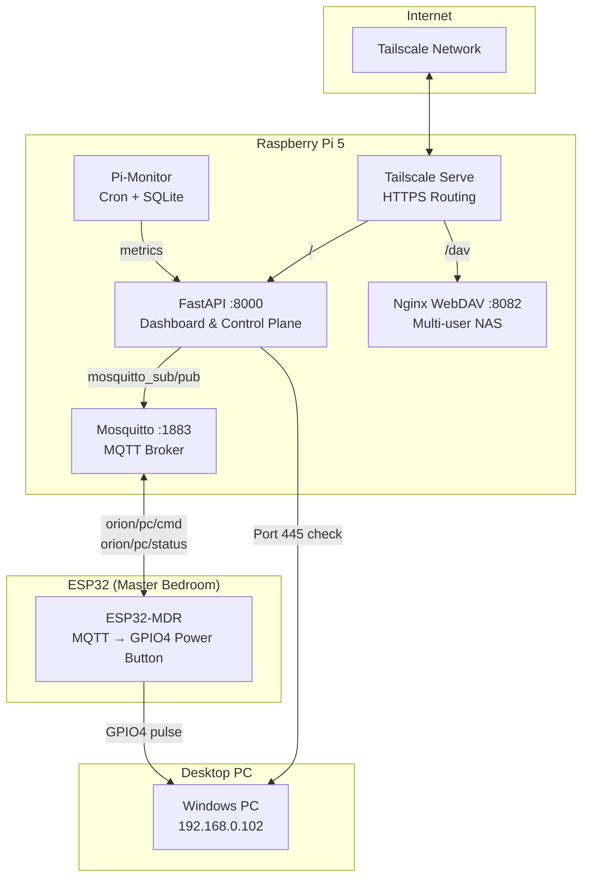
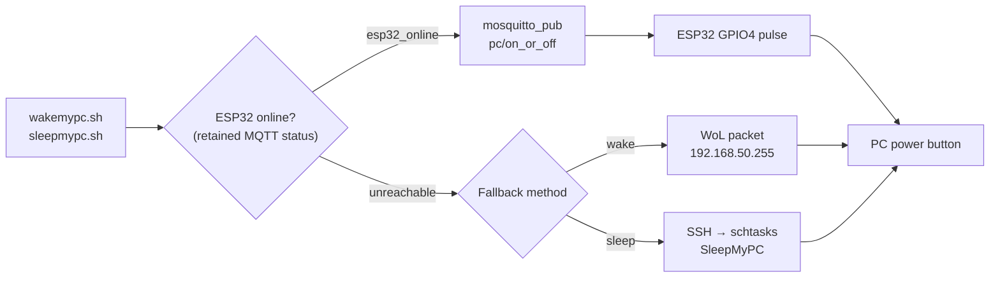

# ORION Architecture

This document describes the **actual working ORION architecture**.

---

## High-Level Overview



---

## 1. Components

### 1.1 FastAPI Web App
- **Service**: `orion-webapp.service`
- **Port**: `8000`
- **Purpose**: Metrics visualization, system control, admin interface, service monitoring.
- **PC Detection**: Socket check on port 445 (SMB) with 2-second TTL cache — replaces the older `ping` method.

### 1.2 Nginx WebDAV
- **Port**: `8082`
- **Auth**: Basic Auth via `/etc/nginx/dav/users.htpasswd`
- **Storage**: `/mnt/orion-nas/users/$remote_user/`
- **Features**: Multi-user isolation, setgid permissions for group persistence.

### 1.3 ESP32 Power Controller (Master Bedroom)
- **Hostname**: `esp-mdr`
- **Firmware**: PlatformIO (see `esp32/`)
- **Function**: Subscribes to MQTT topic `orion/pc/cmd`, shorts GPIO4 to simulate PC power button press.
- **Status**: Publishes retained `esp32_online` / `esp32_offline` (LWT) on `orion/pc/status`.
- **Commands**:

  | Command | Action |
  |---|---|
  | `pc/on_or_off` | Short press (500ms) — wake or sleep |
  | `pc/forceoff` | Long press (5s) — force power off |
  | `pc/pulse/<ms>` | Custom duration pulse |

### 1.4 Mosquitto (MQTT Broker)
- **Service**: `mosquitto.service`
- **Port**: `1883` (on `192.168.0.103`)
- **Purpose**: Message bus between Pi scripts and ESP32 devices.
- **Clients**: ESP32 (subscriber), shell scripts (publisher via `mosquitto_pub`).

### 1.5 Pi-Monitor (Data Collection)
- **Path**: `/home/orion/server/services/pi-monitor/`
- **DB**: SQLite (`pi-monitor.db`)
- **Collection**: Every minute via cron (`pi-monitor.sh`)
- **Archival**: Weekly aggregation and pruning (`archive_weekly.sql`).

### 1.6 Tailscale
- **DNS**: MagicDNS hostname (`orion-raspian`)
- **Routing**: Tailscale Serve handles path-based routing:
  - `/` → FastAPI (`8000`)
  - `/dav` → Nginx WebDAV (`8082`)

---

## 2. PC Wake/Sleep Flow



---

## 3. Service Monitoring

The homepage displays live status for all monitored services:

| Service | Check Method |
|---|---|
| NGINX, SSH, Tailscale, Cron, Bluetooth, mDNS, Wi-Fi, Uvicorn, Mosquitto | `systemctl is-active` |
| ESP32 Master Bedroom | `mosquitto_sub -C 1 -W 2` on retained status |
| Desktop PC | `socket.create_connection` on port 445 |

---

## 4. Storage Design

The system uses a dedicated USB drive mounted at `/mnt/orion-nas`.
- **Filesystem**: ext4
- **Mount**: Configured with `nofail` in `/etc/fstab`.
- **Structure**:
  ```
  /mnt/orion-nas/
  └── users/
      ├── praveen_flip/
      └── ruchi_realme/
  ```

---

## 5. Client Support

- **Primary**: FolderSync (Android)
- **Secondary**: curl, rclone, native OS WebDAV mounting.
- **Unsupported**: Solid Explorer (Authentication issues).

---

## 6. Maintenance

- **Backups**: Scripts in `scripts/` (e.g., `pisync_to_pc.sh`) handle intermittent backups.
- **Cleanup**: Weekly database archival ensures the monitoring database remains performant.

---

## 7. System Integration

To ensure high portability, core system configurations are stored in the repository under `system_configs/` and symlinked to their respective system locations.

### 7.1 Repository Managed (Internal)
*   **Systemd**: `system_configs/systemd/orion-webapp.service` → `/etc/systemd/system/`
*   **Nginx**: `system_configs/nginx/orion-webdav` → `/etc/nginx/sites-available/`
*   **Cron**: `system_configs/cron/crontab.txt` (Template source for `crontab -e`)

### 7.2 System Only (External)
The following items **cannot** be in the repository for security or technical reasons:
*   **Secrets**: `/etc/nginx/dav/users.htpasswd` (Passwords).
*   **Mounts**: `/etc/fstab` (System-specific UUIDs).
*   **Tailscale**: Proprietary state managed by the Tailscale daemon.
*   **Database**: `services/pi-monitor/db/pi-monitor.db` (Git-ignored live data).
*   **MQTT Broker**: Mosquitto config at `/etc/mosquitto/` (system-managed).
