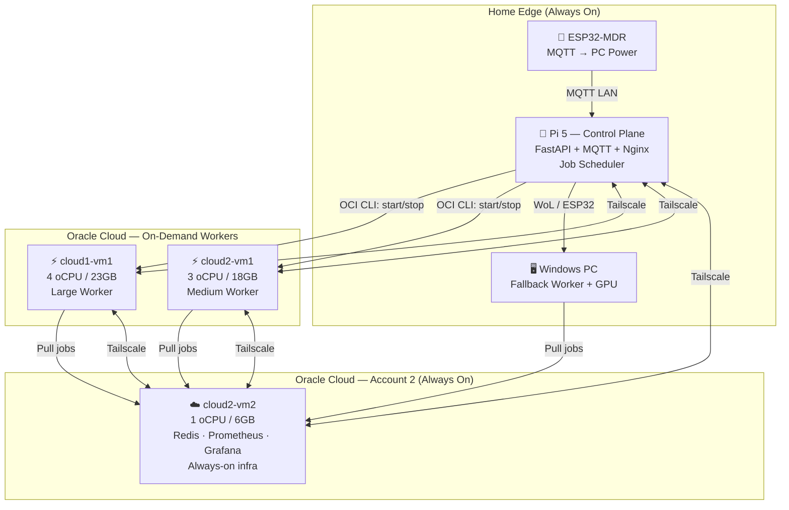

# ORION Distributed Architecture — Refined Plan (v2)

## Updated System Context

- **Jellyfin + Docker** have been uninstalled from Pi (to be reinstalled later)
- **VM3 (1GB)** removed; replaced with **oracle-cloud1-vm1 (4 oCPU / 23GB)** on a separate OCI tenancy
- **Nginx** on Pi currently proxies: `/` → WebDAV, `/app` → FastAPI
- **Tailscale** is for device-to-device mesh, not just Funnel

### Current Node Inventory (Verified)

| Node | Host | IP (Public / Tailscale) | Specs | OS | Status |
|---|---|---|---|---|---|
| Raspberry Pi 5 | `orion-raspian` | `192.168.0.103` / `100.90.202.45` | 4 cores / 4GB | Raspbian 64 | ✅ Online |
| oracle-cloud2-vm1 | `oracle-cloud2-vm1` | `130.162.191.16` / `100.113.71.36` | 3 oCPU / 18GB | Ubuntu 24 aarch64 | ⏸️ Stopped |
| oracle-cloud2-vm2 | `oracle-cloud2-vm2` | `141.147.97.52` / `100.117.244.106` | 1 oCPU / 6GB | Ubuntu 24 aarch64 | ✅ Online |
| oracle-cloud1-vm1 | `oracle-cloud1-vm1` | `80.225.250.148` / `100.69.124.29` | 4 oCPU / 23GB | Ubuntu 24 aarch64 | ⏸️ Stopped |
| Desktop PC | `orion-desktoppc-*` | `192.168.0.102` / `100.91.57.93` | 6 cores / 16GB | Windows | ✅ Online |

---

## Review of the Updated ChatGPT Plan (v1)

### ✅ What's Good

| Aspect | Assessment |
|---|---|
| **Tailscale mesh** instead of Docker Swarm | Correct — much better foundation |
| **On-demand worker lifecycle** | Excellent — start/stop VMs per job, minimize idle cost |
| **Redis job queue on Pi** | Sound choice — lightweight, battle-tested |
| **Worker registration protocol** | Good pattern — dynamic slot-based scheduling |
| **Daily keep-alive** | Smart — prevents Oracle from reclaiming free-tier VMs |
| **Windows PC as fallback worker** | Good use of existing infrastructure |
| **Prometheus + Grafana on VM2** | Right placement — always-on, low-resource node |

### ⚠️ Issues & Gaps

> [!NOTE]
> **Oracle Free Tier — CONFIRMED SAFE.**
>
> Two separate OCI tenancies confirmed:
> - **cloud2** (PAYG account): `vm1` (3 oCPU/18GB) + `vm2` (1 oCPU/6GB) = 4 oCPU / 24GB ← within A1 free tier
> - **cloud1** (Free Tier account): `vm1` (4 oCPU/23GB) ← within A1 free tier
>
> Both are within their respective limits. ✅

> [!NOTE]
> **Redis failover**: Primary on VM2, replica on Pi. If VM2 goes down, Pi auto-promotes to primary. Both use `appendonly yes` for persistence. See design below.

> [!WARNING]
> **Plan lacks concrete implementation details for several components:**
> - How does the Pi start/stop Oracle VMs? (OCI CLI? API? SSH?)
> - How do workers discover the Redis queue? (Tailscale DNS? hardcoded IP?)
> - What is the worker agent — a Python script? A Docker container?
> - Where does job output/artifacts get stored?

> [!IMPORTANT]
> **Other issues found in the ChatGPT plan:**
> - §7 diagram says "VM3 Worker" but the node names don't match — should be `oracle-cloud1-vm1`
> - No mention of Tailscale ACLs or firewall rules — all nodes can currently reach everything
> - Prometheus can't scrape workers that are powered off — needs a push-based model (Pushgateway) or accept gaps
> - No error handling: what if a VM fails to start? Job timeout? Worker crash mid-job?

---

### VM2 Capacity Analysis (Verified)

Live data from `oracle-cloud2-vm2` collected during planning:

| Resource | Total | Used | Available |
|---|---|---|---|
| RAM | 5.8 GB | 483 MB | 5.3 GB |
| Disk | 45 GB | 2.2 GB | 42 GB |
| CPU | 1 oCPU | Load: 0.10 | Plenty |

Estimated infra stack footprint:

| Service | RAM | Disk | CPU |
|---|---|---|---|
| Redis | ~50 MB | ~100 MB | Negligible |
| Prometheus | ~200 MB | ~2 GB (30d retention) | Light |
| Grafana | ~150 MB | ~500 MB | Light |
| Pushgateway | ~30 MB | ~10 MB | Negligible |
| Node Exporter | ~15 MB | ~5 MB | Negligible |
| **Total** | **~450 MB** | **~2.6 GB** | **Light** |

**Verdict: 1 oCPU / 6GB is more than enough.** The infra stack will use <10% of RAM and <6% of disk. The single oCPU handles the query/scrape load easily since these are I/O-bound, not CPU-bound services.

---

## Refined Proposed Architecture



### Key Differences from ChatGPT Plan

| Change | Rationale |
|---|---|
| **Redis primary on VM2, replica on Pi** | VM2 is always-on; Pi has hot standby for failover |
| **Unified machine control (`orion-node`)** | One script to start/stop any node — replaces `wakemypc.sh`/`sleepmypc.sh` |
| **OCI CLI on Pi** for VM lifecycle | Concrete mechanism to start/stop worker VMs programmatically |
| **Workers pull from Redis via Tailscale** | Workers connect to `redis://orion-cloud2-vm2:6379` over Tailscale mesh |
| **Push metrics during worker runs** | Workers push to Prometheus Pushgateway on VM2 before shutdown |
| **Job artifacts stored on VM2** | Results uploaded to VM2 (has 42GB free disk), Pi fetches when needed |
| **Nginx gateway stays on Pi** | Pi already has Tailscale Funnel — no need for a separate gateway node |

---

### Generic Machine Control Design

Currently, `wakemypc.sh` and `sleepmypc.sh` are PC-specific. The distributed architecture needs a **single, unified CLI** to start/stop any node.

#### New design: single `scripts/orion-node` script

Everything lives in one bash script with **methods as functions** — no separate files to maintain:

```
scripts/
├── orion-node              ← Single CLI script (functions for mqtt, wol, ssh, oci, tailscale)
├── machines.conf           ← Machine registry (node → type + params)
├── wakemypc.sh             ← One-liner wrapper → orion-node start desktop-pc
└── sleepmypc.sh            ← One-liner wrapper → orion-node stop desktop-pc
```

Usage:
```
orion-node start <node>     # Start/wake a machine
orion-node stop <node>      # Stop/sleep a machine
orion-node status <node>    # Check reachability via tailscale ping
orion-node list             # All registered nodes + live status
```

Internal structure of `orion-node`:
```bash
#!/usr/bin/env bash
# --- Method functions (not separate files) ---
method_mqtt_start()  { ... mosquitto_pub ... }
method_mqtt_stop()   { ... mosquitto_pub ... }
method_wol_start()   { ... wakeonlan ... }
method_ssh_stop()    { ... ssh $ssh_host ... }
method_oci_start()   { ... oci compute instance action --action START ... }
method_oci_stop()    { ... oci compute instance action --action STOP ... }
status_tailscale()   { ... tailscale ping ... }

# --- Config parser ---
parse_machine_conf() { ... reads machines.conf INI sections ... }

# --- Dispatcher ---
# Reads start_method/stop_method from conf, tries each in order (fallback chain)
```

`machines.conf`:
```ini
[desktop-pc]
start_method=mqtt,wol
stop_method=mqtt,ssh
mqtt_host=192.168.0.103
mqtt_cmd_topic=orion/pc/cmd
mqtt_status_topic=orion/pc/status
wol_mac=A0:CE:C8:0A:4A:1D
wol_broadcast=192.168.50.255
ssh_host=orion-desktoppc-wifi
ssh_user=pkaga
ssh_cmd=schtasks /run /tn SleepMyPC
tailscale_host=orion-desktoppc

[cloud2-vm1]
start_method=oci
stop_method=oci
oci_instance_id=<OCID>
oci_profile=cloud2
tailscale_host=orion-cloud2-vm1

[cloud1-vm1]
start_method=oci
stop_method=oci
oci_instance_id=<OCID>
oci_profile=cloud1
tailscale_host=orion-cloud1-vm1

[cloud2-vm2]
start_method=oci
stop_method=oci
oci_instance_id=<OCID>
oci_profile=cloud2
tailscale_host=orion-cloud2-vm2
```

Callers updated:
- `wakemypc.sh` / `sleepmypc.sh` → one-line wrappers (`exec orion-node start/stop desktop-pc`)
- `main.py` → new generalized endpoints, old PC routes kept as aliases
- All code stays in the repo (`/home/orion/server/scripts/`)

---

### Phase-by-Phase Implementation

#### Phase 0 — Mesh Foundation (all nodes)
- Verify Tailscale mesh (✅ done)
- Harden SSH (key-only, disable root)
- Oracle VCN: allow Tailscale UDP + SSH only
- Install Docker on all VMs
- **Build `orion-node` CLI + `machines.conf` + method scripts**
- **Wrap `wakemypc.sh`/`sleepmypc.sh` as backward-compat shims**
- **Update `main.py` to use generalized node start/stop endpoints**

#### Phase 1 — Infrastructure (VM2: cloud2-vm2)
- Deploy Redis primary (Docker, `appendonly yes`, bound to Tailscale IP)
- Deploy Redis replica on Pi (syncs from VM2, auto-promotes if VM2 down)
- Deploy Prometheus + Node Exporter
- Deploy Grafana
- Deploy Prometheus Pushgateway
- Node Exporter on Pi and VM2
- Bind all services to Tailscale IP only (no public exposure)

#### Phase 2 — Worker Agent (VM1, cloud1-vm1)
- Create `orion-worker` Python agent:
  - On boot: register with Redis (node name, oCPU, RAM, slots)
  - Poll Redis for jobs matching capacity
  - Execute job in Docker container
  - Push result + metrics to VM2
  - On idle timeout: `orion-node stop self` (self-shutdown)
- Install OCI CLI on Pi (used by `orion-node` for VM lifecycle)
- Populate `machines.conf` with OCI instance IDs
- Node Exporter on each worker (scraped while running)

#### Phase 3 — Job Scheduler (Pi)
- Extend FastAPI with job submission API
- Scheduler uses `orion-node start <node>` for worker lifecycle
- Scheduler logic:
  - Small jobs → run locally on Pi
  - Medium → `orion-node start cloud2-vm1`
  - Large → `orion-node start cloud1-vm1`
  - Cloud unavailable → `orion-node start desktop-pc`
- Job status tracking in Redis
- Dashboard UI for queue visibility

#### Phase 4 — Daily Keep-Alive
- Cron on Pi: start each worker VM once daily
- Run health check + `apt update` + small benchmark
- Auto-shutdown after completion
- Log results to Prometheus

#### Phase 5 — Polish & Jellyfin Restoration
- Reinstall Docker + Jellyfin on Pi (restore from existing config on HDD)
- Add cluster status page to ORION dashboard
- Grafana dashboards for job throughput, worker uptime, cost tracking

---

## Verification Plan

| Test | Method | Expected |
|---|---|---|
| Tailscale mesh | `tailscale ping <node>` from each → all others | All 12 pairings succeed |
| Redis reachable | `redis-cli -h <vm2-ts-ip> ping` from Pi | `PONG` |
| VM start/stop | `oci compute instance action` from Pi | VM state changes within 60s |
| Worker registration | Start VM1, check Redis `HGETALL workers` | VM1 entry appears |
| Job execution | Submit test job from Pi dashboard | Result returned, job status = DONE |
| Idle shutdown | Leave worker idle 10 min | VM powers off automatically |
| Keep-alive cron | Wait for daily trigger | VMs start, health check passes, VMs stop |
| Prometheus scrape | `curl vm2:9090/api/v1/targets` | Pi + VM2 always UP |
| MQTT unchanged | `mosquitto_sub -t orion/pc/status -C 1` | `esp32_online` |
| Oracle billing | OCI Console → Cost Analysis | $0.00 |

---

## Mesh Verification Results (2026-03-15)

| Check | Result |
|---|---|
| Tailscale on all nodes | ✅ All 3 VMs + Pi in tailnet |
| VM2 SSH access | ✅ Working (via public IP) |
| VM2 Tailscale ping | ✅ 181ms via DERP relay |
| VM2 Docker | ❌ Not installed yet |
| Worker VMs (vm1, cloud1-vm1) | ⏸️ Stopped (expected) — SSH times out |
| OCI free tier | ✅ Two separate tenancies, both within limits |
