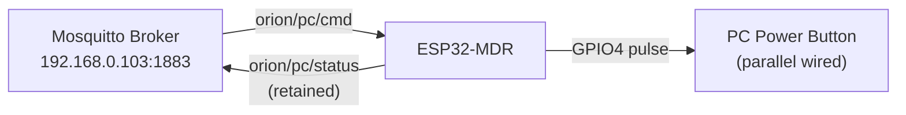
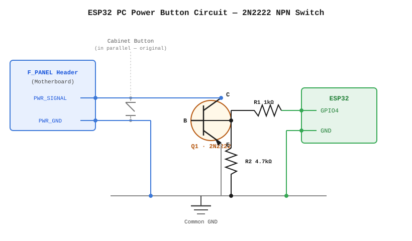

# ESP32 Power Controller (PlatformIO)

This folder contains the **ESP32-MDR** firmware — an MQTT-controlled PC power button relay for the ORION home server.

## How It Works



The ESP32 is wired in **parallel** with the PC's front-panel power button. When it receives a command, it pulls GPIO4 HIGH for a configurable duration, simulating a physical button press.

### MQTT Topics

| Topic | Direction | Description |
|---|---|---|
| `orion/pc/cmd` | Subscribe | Receives power commands |
| `orion/pc/status` | Publish (retained) | `esp32_online` / `esp32_offline` (LWT) |

### Commands

| Command | Pulse Duration | Use Case |
|---|---|---|
| `pc/on_or_off` | 500ms | Wake from off / trigger sleep |
| `pc/on`, `power/on` | 500ms | Aliases (backward compat) |
| `pc/forceoff` | 5000ms | Force power off |
| `pc/pulse/<ms>` | Custom (max 8s) | Custom duration pulse |

## First-Time Setup

1. Install [PlatformIO](https://platformio.org/) in VS Code.
2. Open `esp32/` as the workspace root.
3. Connect your ESP32 DevKit board via USB.
4. Update Wi-Fi credentials in `src/main.cpp` if needed.
5. Build & upload:
   ```bash
   pio run -t upload
   ```
6. Monitor serial output:
   ```bash
   pio device monitor
   ```
7. Verify MQTT connection:
   ```bash
   mosquitto_sub -h 192.168.0.103 -t orion/pc/status -C 1
   # Expected: esp32_online
   ```

## Wiring



### How the Circuit Works

The 2N2222 NPN transistor acts as an open-collector switch wired **in parallel** with the PC cabinet power button. When GPIO4 goes HIGH, the transistor saturates and shorts the two MOBO header pins together — identical to pressing the physical button.

### Component List

| Ref | Component | Value | Purpose |
|---|---|---|---|
| Q1 | NPN Transistor | 2N2222 | Open-collector switch |
| R1 | Resistor | 1 kΩ | GPIO4 to Base (drive current limiting) |
| R2 | Resistor | 4.7 kΩ | Base to Emitter (pull-down, prevents floating) |

### Connections

```
Motherboard F_PANEL Header (2 pins)
  ├── PWR_SIGNAL ──────────────────── Collector (Q1)
  └── PWR_GND   ──────────────────── Emitter  (Q1) ──── Common GND

ESP32
  GPIO4 ── R1 (1kΩ) ── Base (Q1)
                            │
                         R2 (4.7kΩ)
                            │
                        Emitter (Q1) / Common GND

Cabinet Button (original, in parallel — unchanged)
  ├── one wire ── PWR_SIGNAL (Collector node)
  └── other wire ── PWR_GND  (Emitter node)
```

> **Safety**: GPIO4 is configured as `INPUT` (tri-state) when idle and only driven `HIGH` during a commanded pulse. This prevents accidental triggers on ESP32 boot or reset — the transistor stays off when the base is floating/low.

> **Parallel wiring**: The existing cabinet power button remains wired and fully functional alongside the transistor circuit.

## Migrate an Arduino IDE Sketch

1. Save your original `.ino` in `sketches/`.
2. Convert with helper script:
   ```bash
   python3 tools/migrate_ino.py sketches/YourSketch.ino
   ```
3. Build and fix compile issues (typically missing includes, ordering, or library deps).
4. Add libraries in `platformio.ini` under `lib_deps`.

## Notes

- PlatformIO project config is in `platformio.ini`.
- Build output is generated under `.pio/` and should not be committed.
- Keep one active firmware entrypoint in `src/main.cpp`.
